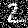
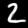
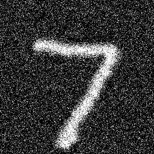

# CUDA MNIST denoising
MNIST denoising auto-encoder on CUDA from scratch

Low (28x28) and high (256x256) resolution examples:  
  
   
 

## Requirements
Tested with CUDA 11.6, NVCC 11.6, Ubuntu 20.04

## Compile
    cd project_folder
    nvcc -O2 kernel.cu main.cpp -o denoiser

## Run
    ./denoiser {input_img_path} [optional -benchmark N]
    if N > 0 runs multiple times and measure time 

## Optimizations

#### Baseline  
Img shape: 28x28x1  
Num runs: 1000  
Total GPU time: 6034.27 ms  
AVG one forward pass GPU time: 6.03427 ms  

#### Merging activations with layers  
Img shape: 28x28x1   
Num runs: 1000  
Total GPU time: 5998.17 ms  
AVG one forward pass GPU time: 5.99817 ms  

#### Using shared memory for caching input tensor
Img shape: 28x28x1  
Num runs: 1000  
Total GPU time: 3673.7 ms  
AVG one forward pass GPU time: 3.6737 ms  
